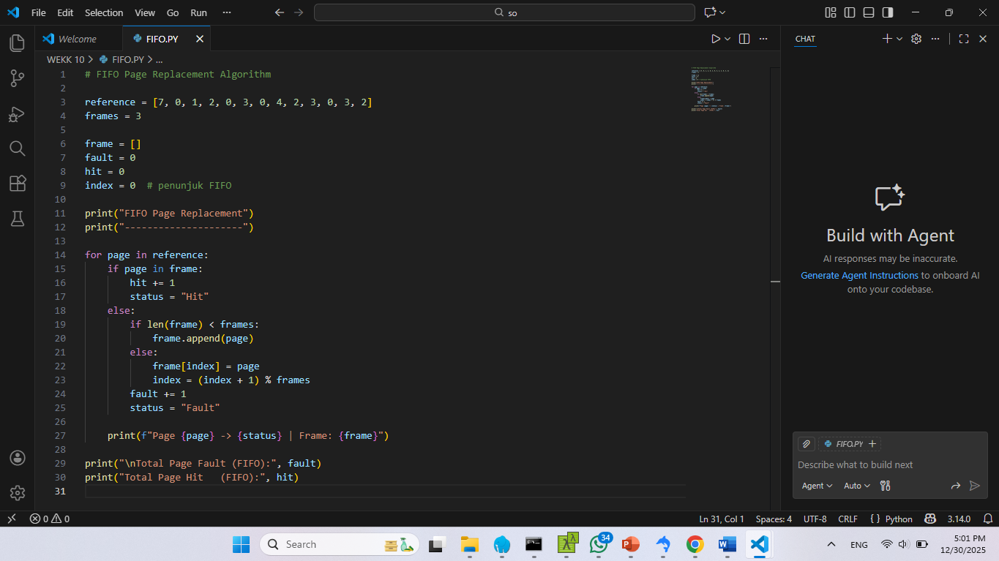
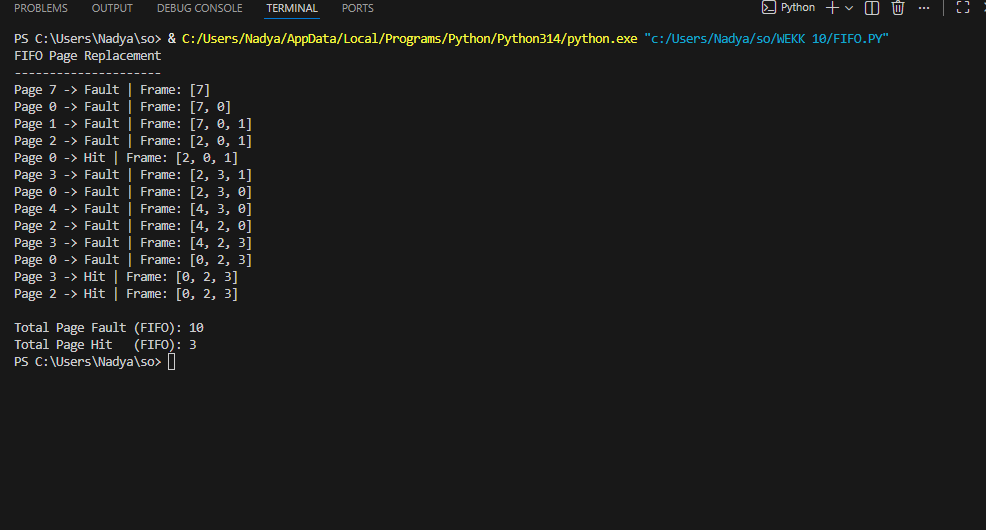
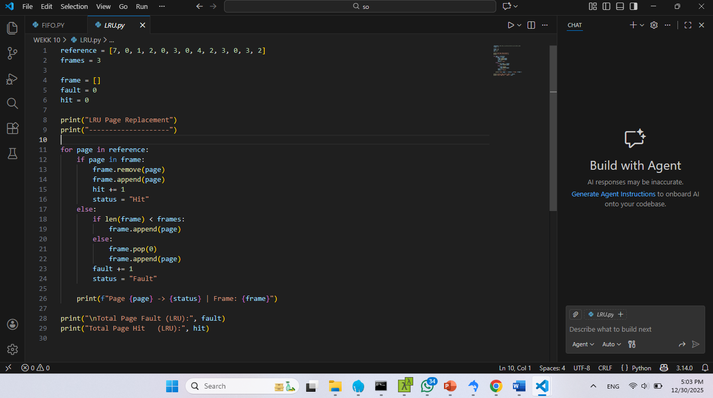
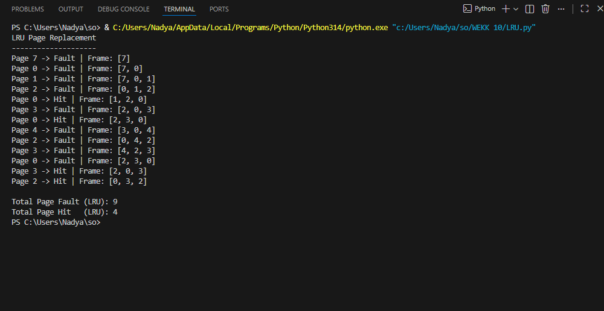

# Laporan Praktikum Minggu [10]
Topik: Page Replacement

---

## Identitas
- **Nama**  : Nadya Pramudita 
- **NIM**   : 250202956  
- **Kelas** : 1IKRA

---

## Tujuan
1. Mengimplementasikan algoritma page replacement FIFO dalam program.
2. Mengimplementasikan algoritma page replacement LRU dalam program.
3. Menjalankan simulasi page replacement dengan dataset tertentu.
4. Membandingkan performa FIFO dan LRU berdasarkan jumlah *page fault*.
5. Menyajikan hasil simulasi dalam laporan yang sistematis.
s
---

## Dasar Teori
1. Keterbatasan memori fisik
Memori utama memiliki kapasitas terbatas, sehingga sistem operasi perlu mengganti halaman di memori ketika halaman baru harus dimuat.

2. Page fault sebagai pemicu penggantian halaman
Page replacement terjadi saat terjadi page fault, yaitu ketika halaman yang dibutuhkan proses tidak tersedia di memori fisik.

3. Tujuan utama: meminimalkan page fault
Algoritma page replacement dirancang untuk memilih halaman yang paling tepat untuk diganti agar jumlah page fault seminimal mungkin.

4. Prinsip locality of reference
Program cenderung mengakses halaman yang sama atau berdekatan dalam waktu dekat, sehingga halaman yang baru digunakan sebaiknya dipertahankan di memori.

5. Perbedaan algoritma memengaruhi performa sistem
Algoritma seperti FIFO, LRU, dan Optimal memiliki karakteristik berbeda yang berdampak langsung pada efisiensi penggunaan memori dan kinerja sistem.

---

## Langkah Praktikum
1. Langkah-langkah yang dilakukan.  
2. Perintah yang dijalankan.  
3. File dan kode yang dibuat.  
4. Commit message yang digunakan.

---

## Kode / Perintah
1. **Menyiapkan Dataset**

   Gunakan *reference string* berikut sebagai contoh:
   ```
   7, 0, 1, 2, 0, 3, 0, 4, 2, 3, 0, 3, 2
   ```
   Jumlah frame memori: **3 frame**.

2. **Implementasi FIFO**

   - Simulasikan penggantian halaman menggunakan algoritma FIFO.
   - Catat setiap *page hit* dan *page fault*.
   - Hitung total *page fault*.

3. **Implementasi LRU**

   - Simulasikan penggantian halaman menggunakan algoritma LRU.
   - Catat setiap *page hit* dan *page fault*.
   - Hitung total *page fault*.

4. **Eksekusi & Validasi**

   - Jalankan program untuk FIFO dan LRU.
   - Pastikan hasil simulasi logis dan konsisten.
   - Simpan screenshot hasil eksekusi.

5. **Analisis Perbandingan**

   Buat tabel perbandingan seperti berikut:

   | Algoritma | Jumlah Page Fault | Keterangan |
   |:--|:--:|:--|
   | FIFO | ... | ... |
   | LRU | ... | ... |


   - Jelaskan mengapa jumlah *page fault* bisa berbeda.
   - Analisis algoritma mana yang lebih efisien dan alasannya.

6. **Commit & Push**

   ```bash
   git add .
   git commit -m "Minggu 10 - Page Replacement FIFO & LRU"
   git push origin main
   ```


---

## Hasil Eksekusi
FIFO

OUTPUT

LRU

OUTPUT


---

## Analisis
   Buat tabel perbandingan seperti berikut:

   | Algoritma | Jumlah Page Fault | Keterangan |
   |:--|:--:|:--|
   | FIFO | 10 | Mengganti halaman yang pertama kali masuk tanpa melihat frekuensi/riwayat pemakaian |
   | LRU | 9 | Mengganti halaman yang paling lama tidak digunakan|


   - Jelaskan mengapa jumlah *page fault* bisa berbeda.
  
Jumlah page fault berbeda karena cara pemilihan halaman yang diganti pada tiap algoritma:

FIFO tidak mempertimbangkan apakah halaman masih sering digunakan. Akibatnya, halaman yang masih dibutuhkan bisa terhapus dan menimbulkan page fault tambahan.

LRU mempertimbangkan riwayat penggunaan, sehingga halaman yang sering dipakai cenderung tetap berada di memori.

   - Analisis algoritma mana yang lebih efisien dan alasannya.

LRU lebih efisien dibanding FIFO, karena:
- Menghasilkan page fault lebih sedikit (9 < 10)
- Lebih adaptif terhadap pola akses memori
- SMendekati perilaku optimal dalam penggunaan memori

---

## Kesimpulan
Algoritma page replacement FIFO dan LRU berhasil diimplementasikan dan disimulasikan dengan menggunakan reference string dan jumlah frame yang sama, sehingga dapat dibandingkan secara objektif.

Hasil simulasi menunjukkan bahwa algoritma LRU menghasilkan jumlah page fault lebih sedikit dibanding FIFO, karena mempertimbangkan riwayat penggunaan halaman dan memanfaatkan prinsip locality of reference.

Berdasarkan hasil analisis, LRU lebih efisien dibanding FIFO dalam mengelola memori karena mampu mempertahankan halaman yang masih sering digunakan dan memberikan performa yang lebih baik.

---

### Tugas & Quiz
### Tugas
1. Buat program simulasi page replacement FIFO dan LRU.
2. Jalankan simulasi dengan dataset uji.
3. Sajikan hasil simulasi dalam tabel atau grafik.
4. Tulis laporan praktikum pada `laporan.md`.

### Quiz
1. Apa perbedaan utama FIFO dan LRU?
2. Mengapa FIFO dapat menghasilkan *Belady’s Anomaly*?
3. Mengapa LRU umumnya menghasilkan performa lebih baik dibanding FIFO?
 
**Jawaban:**  
1. Perbedaan utama FIFO dan LRU

- FIFO (First-In First-Out)
Mengganti halaman yang paling lama masuk ke memori, tanpa memperhatikan apakah halaman tersebut masih sering digunakan atau tidak. Sederhana, tetapi tidak mempertimbangkan pola akses.

- LRU (Least Recently Used)
Mengganti halaman yang paling lama tidak digunakan berdasarkan riwayat akses terbaru.
Lebih adaptif karena mempertimbangkan kebiasaan akses program.

2. Belady’s Anomaly adalah kondisi di mana penambahan jumlah frame justru meningkatkan jumlah page fault.
Hal ini bisa terjadi pada FIFO karena:

- FIFO tidak mempertimbangkan frekuensi atau kepentingan halaman.

- Halaman yang masih sering digunakan bisa terhapus hanya karena datang lebih awal.

- Ketika frame ditambah, urutan keluar-masuk halaman berubah, sehingga keputusan penggantian menjadi kurang optimal.

3. Mengapa LRU umumnya menghasilkan performa lebih baik dibanding FIFO?

- LRU memanfaatkan prinsip locality of reference (halaman yang baru dipakai kemungkinan besar akan dipakai lagi).

- Halaman yang jarang digunakan lebih mungkin diganti.

- Tidak mengalami Belady’s Anomaly, karena termasuk algoritma stack algorithm.

- Lebih akurat dalam mencerminkan perilaku nyata program.

---

## Refleksi Diri
Tuliskan secara singkat:
- Apa bagian yang paling menantang minggu ini?  
- Bagaimana cara Anda mengatasinya?  

---

**Credit:**  
_Template laporan praktikum Sistem Operasi (SO-202501) – Universitas Putra Bangsa_
