# Laporan Praktikum Minggu XII
Topik: Virtual Machine

---

## ANGGOTA KELOMPOKN
1. Evelin Natalie (250202916)
2. Faik Setyawan (250202936)
3. Nadya Pramudita (250202956)
---

## Tujuan
Setelah menyelesaikan tugas ini, mahasiswa mampu:
1. Menginstal perangkat lunak virtualisasi (VirtualBox/VMware).  
2. Membuat dan menjalankan sistem operasi guest di dalam VM.  
3. Mengatur konfigurasi resource VM (CPU, RAM, storage).  
4. Menjelaskan mekanisme proteksi OS melalui virtualisasi.  
5. Menyusun laporan praktikum instalasi dan konfigurasi VM secara sistematis.

---

## Dasar Teori

1. **Konsep Virtualisasi Perangkat Keras**
   Virtual Machine bekerja berdasarkan teknologi virtualisasi yang memungkinkan satu perangkat keras fisik menjalankan beberapa sistem operasi secara bersamaan dengan memanfaatkan lapisan abstraksi.

2. **Peran Hypervisor**
   Hypervisor adalah komponen utama yang bertugas mengelola dan membagi resource fisik seperti CPU, memori, dan penyimpanan kepada setiap VM secara terisolasi dan terkontrol.

3. **Isolasi Sistem Operasi**
   Setiap VM memiliki sistem operasi sendiri yang berjalan secara independen, sehingga gangguan atau kegagalan pada satu VM tidak memengaruhi VM lainnya maupun host.

4. **Manajemen dan Alokasi Resource**
   Virtual Machine memungkinkan pengaturan alokasi resource yang jelas dan tetap, sehingga penggunaan CPU, memori, dan storage dapat dikontrol sesuai kebutuhan masing-masing VM.

5. **Keamanan dan Stabilitas Lingkungan**
   Tingkat isolasi yang tinggi pada VM meningkatkan keamanan dan stabilitas sistem, karena aktivitas di dalam VM tidak langsung berdampak pada sistem host atau VM lain.

---

## Langkah Praktikum
1. **Instalasi Virtual Machine**
   - Instal VirtualBox atau VMware pada komputer host.  
   - Pastikan fitur virtualisasi (VT-x / AMD-V) aktif di BIOS.

2. **Pembuatan OS Guest**
   - Buat VM baru dan pilih OS guest (misal: Ubuntu Linux).  
   - Atur resource awal:
     - CPU: 1–2 core  
     - RAM: 2–4 GB  
     - Storage: ≥ 20 GB

3. **Instalasi Sistem Operasi**
   - Jalankan proses instalasi OS guest sampai selesai.  
   - Pastikan OS guest dapat login dan berjalan normal.

4. **Konfigurasi Resource**
   - Ubah konfigurasi CPU dan RAM.  
   - Amati perbedaan performa sebelum dan sesudah perubahan resource.

5. **Analisis Proteksi OS**
   - Jelaskan bagaimana VM menyediakan isolasi antara host dan guest.  
   - Kaitkan dengan konsep *sandboxing* dan *hardening* OS.

6. **Dokumentasi**


   - Ambil screenshot setiap tahap penting.  
   - Simpan di folder `screenshots/`.

7. **Commit & Push**
   ```bash
   git add .
   git commit -m "Minggu 12 - Virtual Machine"
   git push origin main
   ```


---

## Hasil Eksekusi
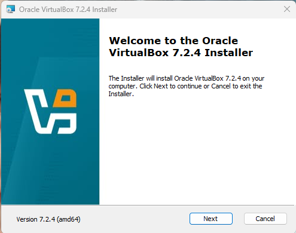 
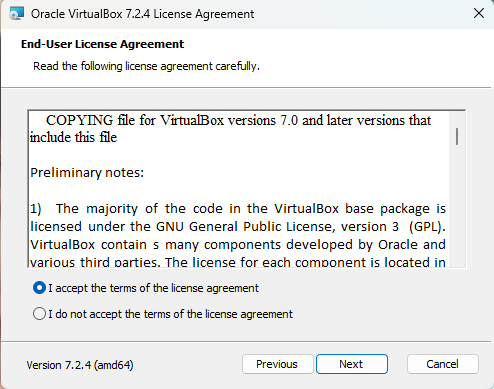 
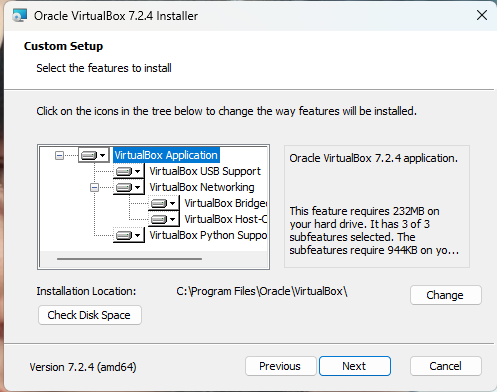 
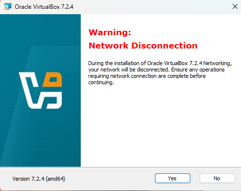 
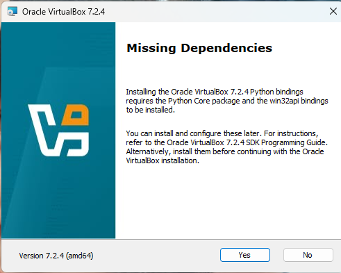
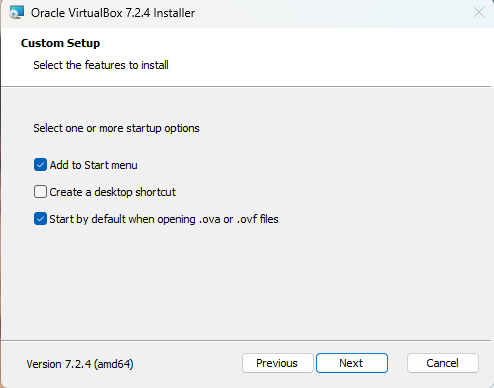 
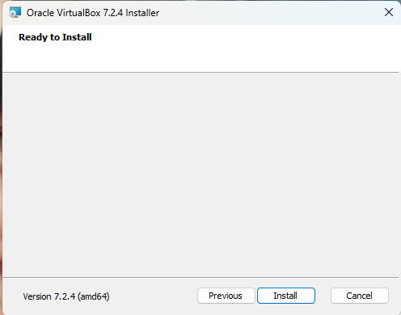 
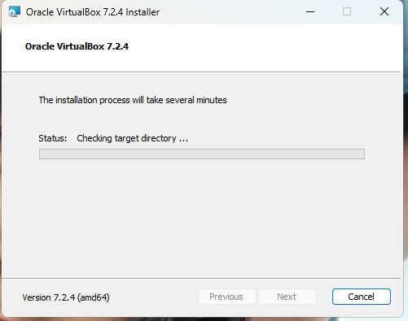 
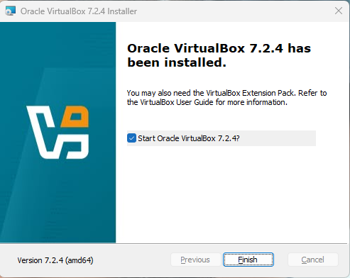 
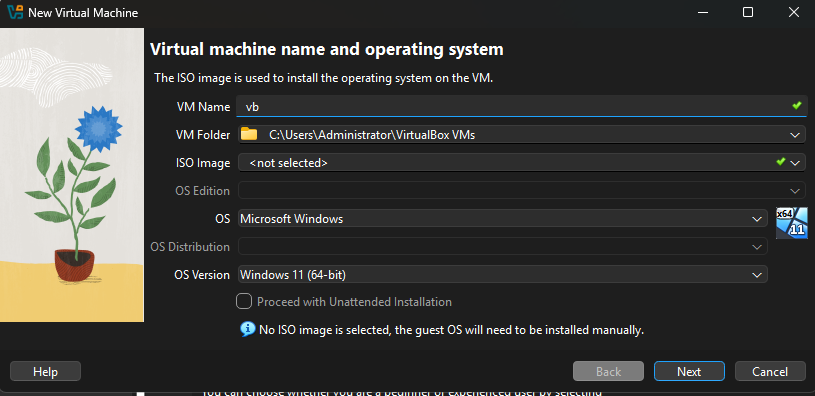 
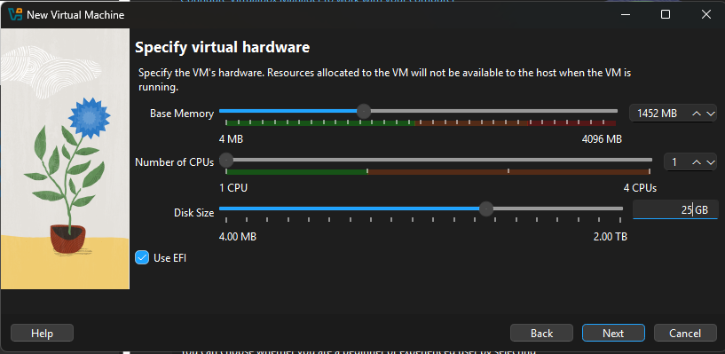 
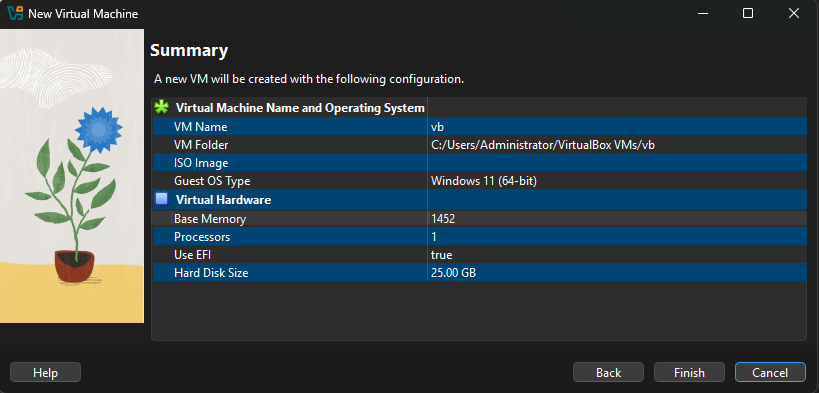 
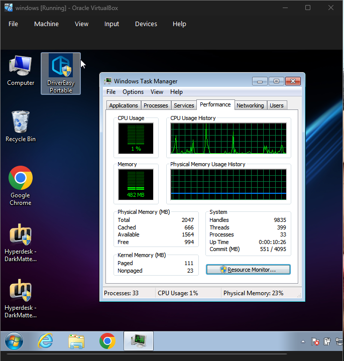

---

## Analisis
- Jelaskan bagaimana VM menyediakan isolasi antara host dan guest.  
- Kaitkan dengan konsep *sandboxing* dan *hardening* OS.
Berikut penjelasannya secara runtut dan mudah dipahami:


- Bagaimana VM Menyediakan Isolasi antara Host dan Guest

Virtual Machine (VM) menyediakan **isolasi** dengan cara menjalankan sistem operasi *guest* di atas **hypervisor**, bukan langsung di atas perangkat keras (*hardware*). Mekanisme isolasinya meliputi:

* **Abstraksi hardware**
  Hypervisor menyediakan perangkat keras virtual (CPU, RAM, disk, network) sehingga *guest OS* tidak memiliki akses langsung ke hardware fisik host.

* **Isolasi memori**
  Setiap VM memiliki ruang memori sendiri. Guest OS tidak dapat membaca atau menulis memori VM lain maupun memori host.

* **Isolasi CPU dan proses**
  Instruksi CPU dari guest dijalankan dalam mode terbatas (non-privileged). Instruksi sensitif akan dicegat dan dikontrol oleh hypervisor.

* **Isolasi sistem file dan perangkat**
  Guest hanya melihat *virtual disk* dan *virtual device*. Kerusakan atau malware di dalam VM tidak langsung memengaruhi sistem host.

Dengan mekanisme ini, kegagalan sistem, error konfigurasi, atau serangan di dalam VM **tidak menyebar** ke host maupun VM lainnya.


- Kaitan dengan Konsep *Sandboxing*

**Sandboxing** adalah teknik menjalankan aplikasi atau sistem dalam lingkungan terbatas agar tidak dapat merusak sistem utama.

Kaitannya dengan VM:

* VM bertindak sebagai **sandbox tingkat sistem operasi**.
* Seluruh guest OS dan aplikasinya berjalan dalam lingkungan terisolasi.
* Aktivitas berbahaya (misalnya malware, exploit) tetap berada di dalam VM.

Contoh:

> Menjalankan aplikasi tidak terpercaya di dalam VM → jika terjadi serangan, dampaknya hanya pada VM tersebut.

Dengan kata lain, **VM = sandbox yang lebih kuat dan menyeluruh** dibanding sandbox aplikasi biasa.


- Kaitan dengan Konsep *Hardening* Sistem Operasi

**OS Hardening** adalah proses memperkuat keamanan sistem dengan mengurangi permukaan serangan.

VM mendukung hardening melalui:

* **Pembatasan akses**
  Guest OS tidak memiliki hak administratif ke hardware host.
* **Segmentasi sistem**
  Layanan penting bisa dipisah ke VM berbeda (misalnya VM database dan VM web server).
* **Snapshot dan rollback**
  Jika terjadi kompromi, VM dapat dikembalikan ke kondisi aman sebelumnya.
* **Minim layanan**
  Guest OS dapat dikonfigurasi lebih ringan dan hanya menjalankan layanan yang diperlukan.

Dengan VM, hardening dapat dilakukan **berlapis**:

* Hardening pada **host OS**
* Hardening pada **hypervisor**
* Hardening pada **guest OS**


---

## Kesimpulan

Dari praktikum yang telah dilakukan, dapat disimpulkan bahwa Virtual Machine (VM) memungkinkan satu komputer menjalankan beberapa sistem operasi secara bersamaan dengan bantuan hypervisor. Hypervisor berfungsi mengatur dan membagi sumber daya seperti CPU, RAM, dan storage kepada setiap guest OS.

Virtualisasi memberikan isolasi antara host OS dan guest OS, sehingga gangguan atau kesalahan pada guest OS tidak memengaruhi sistem host. Selain itu, VM mendukung konsep sandboxing dan OS hardening, yang membantu meningkatkan keamanan dan stabilitas sistem.

Melalui praktikum ini, mahasiswa dapat memahami cara instalasi, konfigurasi, serta manfaat penggunaan Virtual Machine dalam pengelolaan dan pengamanan sistem operasi.


---

## Tugas & Quiz
### Tugas
1. Instal dan jalankan OS guest menggunakan VM.  
2. Konfigurasikan resource VM sesuai instruksi.  
3. Dokumentasikan proses instalasi dan konfigurasi.  
4. Tulis laporan praktikum pada `laporan.md`.

### Quiz
Jawab pada bagian **Quiz** di laporan:
1. Apa perbedaan antara host OS dan guest OS?

Host OS adalah sistem operasi utama yang terpasang langsung pada komputer fisik (hardware). Host OS mengelola sumber daya seperti CPU, RAM, dan storage. Sedangkan 
Guest OS adalah sistem operasi yang berjalan di dalam mesin virtual (virtual machine) di atas host OS. Guest OS tidak berinteraksi langsung dengan hardware, melainkan melalui lapisan virtualisasi.

Contoh:
Windows 11 terpasang di laptop (host OS), lalu di dalamnya dijalankan Ubuntu,Linux mint,windows DLL menggunakan VirtualBox (guest OS).

2. Apa peran hypervisor dalam virtualisasi?

Hypervisor berfungsi sebagai pengelola dan penghubung antara hardware fisik dan mesin virtual.

Peran utamanya:
- Membuat dan menjalankan mesin virtual (VM)
- Membagi sumber daya hardware (CPU, RAM, storage) ke tiap VM
- Menjaga agar satu VM tidak mengganggu VM lain

3. Mengapa virtualisasi meningkatkan keamanan sistem?

Virtualisasi meningkatkan keamanan karena:

Setiap VM terpisah, sehingga jika satu guest OS terkena virus atau error, tidak langsung memengaruhi host OS atau VM lain, Aplikasi atau kode berbahaya bisa diuji di VM tanpa merusak sistem utama, Sistem bisa dikembalikan ke kondisi aman sebelumnya dengan cepat dan Guest OS tidak memiliki akses langsung ke hardware fisik.

---

## Refleksi Diri
Tuliskan secara singkat:
- Apa bagian yang paling menantang minggu ini?  
- Bagaimana cara Anda mengatasinya?  

---

**Credit:**  
_Template laporan praktikum Sistem Operasi (SO-202501) – Universitas Putra Bangsa_